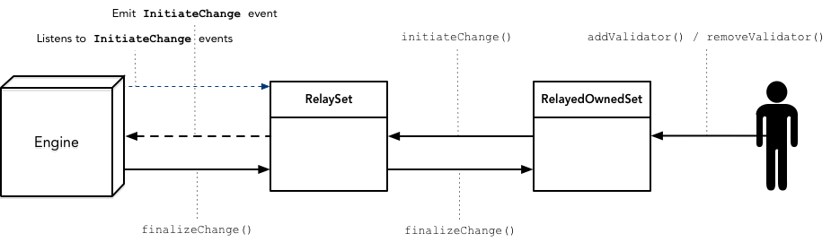

# kovan-validator-set

[![Build Status][travis-image]][travis-url]
[![Solidity Coverage Status][coveralls-image]][coveralls-url]

[travis-image]: https://travis-ci.org/parity-contracts/kovan-validator-set.svg?branch=master
[travis-url]: https://travis-ci.org/parity-contracts/kovan-validator-set
[coveralls-image]: https://coveralls.io/repos/github/parity-contracts/kovan-validator-set/badge.svg?branch=master
[coveralls-url]: https://coveralls.io/github/parity-contracts/kovan-validator-set?branch=master

Validator set contracts for Kovan network.

## Description

This repo contains [`ValidatorSet`](https://wiki.parity.io/Validator-Set) contract implementations
that are owned by an address. The owner of the validator set can manage the set by adding or
removing validators.

It also includes a relay set contract (`RelaySet`) which relays calls to an inner validator set
contract and allows upgrading the relayed contract. It exposes an `initiateChange` method for the
relayed contract to trigger an initiate change event in the relay, since the engine will be
listening to events from the relay.



There are two concrete contracts available:
 - `OwnedSet` - for direct usage of an owned validator set contract
 - `RelayedOwnedSet` - meant to be used as the relayed contract of a relay validator set

## Getting started

This project uses the [Truffle](http://truffleframework.com/) framework. To install the required
dependencies run:

```
yarn install
```

To run the test suite:

```
yarn test
```
